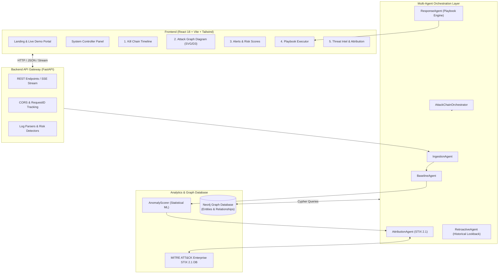
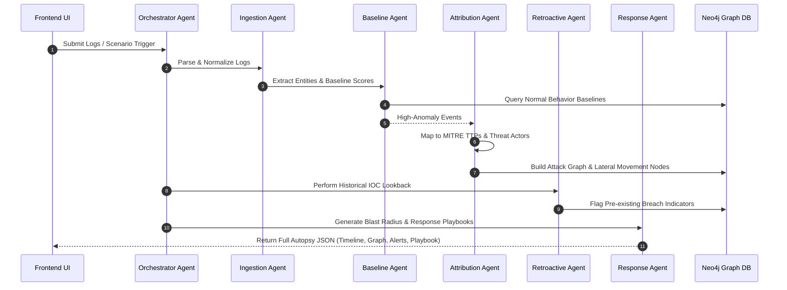
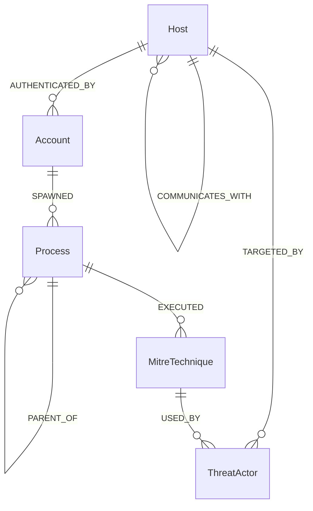

# 🛡️ Attack Chain Autopsy Engine — System Architecture & Technical Specifications

> **AI-Powered Cyber Resilience Platform for Critical National Infrastructure (CNI)**  
> *Autonomous Multi-Agent Incident Autopsy, Temporal Reconstruction & Graph-Based Threat Attribution*

---

## 📌 1. Executive Summary

Modern cyberattacks on Critical National Infrastructure (e.g., healthcare, energy grids, education boards) do not happen in isolation—they unfold over days or weeks through multi-stage **Attack Chains**. Traditional SIEM/SOC tools overwhelm analysts with disconnected alerts.

**Attack Chain Autopsy Engine** solves this by leveraging a **Multi-Agent AI Architecture** combined with **Neo4j Graph Database** modeling to reconstruct the complete timeline, map lateral movement, identify threat actors using MITRE ATT&CK STIX 2.1 data, and execute autonomous response playbooks.

---

## 🏗️ 2. High-Level System Architecture

The system follows a modern micro-decoupled architecture consisting of a **React Single-Page Application (SPA)**, a **FastAPI Microservices Backend**, an **Autonomous Multi-Agent Pipeline**, a **Neo4j Property Graph Database**, and **LLM/ML Analytics Engine**.



---

## 🤖 3. Multi-Agent System Architecture

The core processing engine is driven by 5 specialized AI agents orchestrated by a master controller:



### Agent Responsibilities

| Agent Name | Module File | Key Responsibilities |
| :--- | :--- | :--- |
| **`AttackChainOrchestrator`** | `backend/agents/orchestrator.py` | Coordinates agent execution pipelines, manages async agent state, aggregates final autopsy payload. |
| **`IngestionAgent`** | `backend/agents/ingestion_agent.py` | Parses Syslog, Windows Event Logs (4624, 4688, 5140), and JSON formats into uniform `SecurityEvent` schema. |
| **`BaselineAgent`** | `backend/agents/baseline_agent.py` | Computes behavioral baselines per user/host. Feeds anomaly metrics into `AnomalyScorer`. |
| **`AttributionAgent`** | `backend/agents/attribution_agent.py` | Queries MITRE ATT&CK STIX 2.1 taxonomy, attributes TTPs, calculates Threat Actor confidence scores (e.g., APT29, Lazarus). |
| **`RetroactiveAgent`** | `backend/agents/retroactive_agent.py` | Time-travel threat hunter. Scans historic logs for new threat intelligence IOCs to reveal stealthy sleeper breaches. |
| **`AutonomousResponseAgent`** | `backend/agents/response_agent.py` | Calculates threat blast radius, recommends step-by-step mitigation actions, executes automated playbooks. |

---

## 🗄️ 4. Neo4j Graph Database Schema

The graph engine constructs an interconnected web of digital forensic evidence using Cypher queries.



### Graph Nodes & Relationships

* **Nodes:**
  * `:Host` (Hostname, IP, OS, Asset Criticality)
  * `:Account` (Username, Domain, Privilege Level)
  * `:Process` (Process Name, PID, Command Line, Hash)
  * `:IPAddress` (IP, Geo, Reputation Score)
  * `:MitreTechnique` (Technique ID e.g., `T1059`, Tactic Name, STIX Ref)
  * `:ThreatActor` (Actor Name e.g., `APT29`, Country, Targeted Sectors)
* **Relationships:**
  * `(h:Host)-[:CONNECTED_TO {port: 445, timestamp: ...}]->(h2:Host)`
  * `(a:Account)-[:LOGGED_IN {auth_type: "Kerberos"}]->(h:Host)`
  * `(p:Process)-[:EXECUTED_COMMAND]->(t:MitreTechnique)`
  * `(h:Host)-[:COMPROMISED_IN_STAGE {stage: "Initial Access"}]->(c:ChainNode)`

---

## 🎨 5. Frontend & UI Architecture (The 5 Core Tabs)

The user interface (`frontend/src`) provides security analysts with a unified 5-view dashboard:

```
┌────────────────────────────────────────────────────────────────────────────────────────┐
│ 🛡️ ATTACK CHAIN AUTOPSY ENGINE | [ AIIMS Ransomware Demo ]  [ CBSE Breach Demo ]       │
├──────────────┬──────────────────┬─────────────┬──────────────────┬─────────────────────┤
│ ⚔️ Kill Chain │ 🕸️ Attack Graph │ 🚨 Alerts   │ 📘 Playbook      │ 🧠 Threat Intel     │
├──────────────┴──────────────────┴─────────────┴──────────────────┴─────────────────────┤
│                                                                                        │
│  [Tab 1: Chronological Attack Progression Timeline]                                    │
│  [Tab 2: Interactive Network Node Map & Lateral Movement]                              │
│  [Tab 3: Real-Time Risk Anomaly Scores & Event Logs]                                   │
│  [Tab 4: One-Click Containment & Remediation Actions]                                  │
│  [Tab 5: Threat Actor Profiles, MITRE TTPs & IOC Intelligence]                         │
│                                                                                        │
└────────────────────────────────────────────────────────────────────────────────────────┘
```

1. **Kill Chain View (`AttackChainTimeline.jsx`):** Chronological multi-stage timeline (Recon $\rightarrow$ Execution $\rightarrow$ Persistence $\rightarrow$ Data Exfiltration).
2. **Attack Graph View (`AttackPathDiagram.jsx`):** Custom SVG/D3 interactive graph showing host-to-host lateral movement, compromised accounts, and blast radius.
3. **Alerts Panel (`SystemControllerPanel.jsx`):** Anomaly scores, risk levels, and raw event log inspection.
4. **Playbook Executor (`PlaybookExecutor.jsx`):** Guided response workflows (e.g., *Isolate Host*, *Revoke Tokens*, *Block Malicious IP*).
5. **Threat Intel Panel (`ThreatIntelPanel.jsx`):** Threat actor attribution, MITRE ATT&CK mapping, and IOC matching feeds.

---

## ⚡ 6. API Endpoint Reference

The backend exposes FastAPI endpoints (`backend/main.py`):

* **`POST /api/v1/analyze`**: Runs full multi-agent autopsy on uploaded log files or JSON scenarios.
* **`GET /api/v1/graph`**: Fetches the Neo4j attack graph nodes and edges for visual rendering.
* **`GET /api/v1/demo/aiims`**: Loads pre-built AIIMS Ransomware incident dataset.
* **`GET /api/v1/demo/cbse`**: Loads pre-built CBSE Data Breach dataset.
* **`POST /api/v1/playbook/execute`**: Triggers automated response actions (e.g., host isolation).
* **`POST /api/v1/retroactive/scan`**: Initiates retroactive IOC hunting on historical logs.

---

## 🧰 7. Tech Stack Overview

| Layer | Technology | Purpose |
| :--- | :--- | :--- |
| **Frontend Framework** | React 18, Vite | High-performance SPA with instant HMR |
| **UI & Styling** | Vanilla CSS, Tailwind CSS, Framer Motion | Cyberpunk / Sleek SOC Dark Mode Aesthetics |
| **Backend Framework** | Python 3.10+, FastAPI, Uvicorn | Async REST API & Agent Pipeline |
| **Graph Database** | Neo4j Graph Database | Entity relationships & lateral movement graphing |
| **Threat Intelligence** | MITRE ATT&CK STIX 2.1 | Standardized cyber threat taxonomy |
| **Data Parsing / ML** | NumPy, Scikit-learn, Custom AnomalyScorer | Statistical baseline deviation calculation |

---

## 🚀 8. Setup & Execution Instructions

### Backend Setup
```bash
cd attack-chain-autopsy
python -m venv venv
venv\Scripts\activate
pip install -r requirements.txt
uvicorn backend.main:app --reload --host 0.0.0.0 --port 8000
```

### Frontend Setup
```bash
cd attack-chain-autopsy/frontend
npm install
npm run dev
```

---
*Created automatically for ET-Hackathon Project.*
