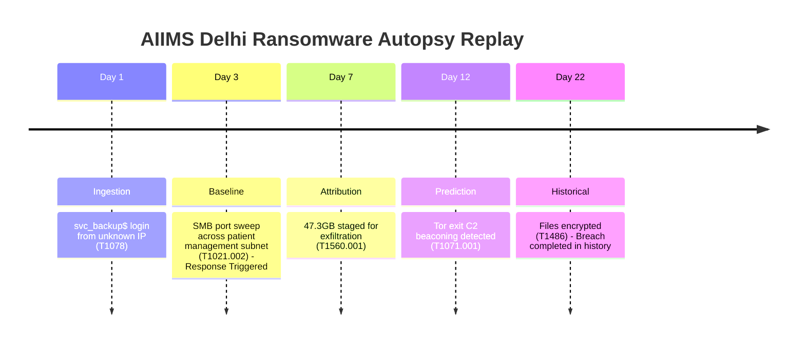

# ⚔️ Attack Chain Autopsy Engine

### **AI-Powered Cyber Resilience & Retroactive Incident Reconstruction for Critical National Infrastructure (CNI)**

[](https://www.python.org/)
[](https://reactjs.org/)
[](https://fastapi.tiangolo.com/)
[](https://neo4j.com/)
[](https://python.langchain.com/docs/langgraph/)
[](https://groq.com/)
[](https://opensource.org/licenses/MIT)

> *"We don't just detect attacks. We reconstruct the chronological chain of failures that made them invisible, and prove exactly when and how a modern AI baseline would have stopped them."*
>
> **Built for ET AI Hackathon 2026 — Problem Statement 7**

---

## 📖 Table of Contents
- [🧬 The Core Differentiator](#-the-core-differentiator)
- [🏗️ System Architecture & LangGraph Pipeline](#%EF%B8%8F-system-architecture--langgraph-pipeline)
- [⚡ Premium UI & Autopsy Dashboard](#-premium-ui--autopsy-dashboard)
- [🚀 Quick Start & Deployment](#-quick-start--deployment)
- [🎬 Live Demo Scenario: AIIMS Delhi 2022](#-live-demo-scenario-aiims-delhi-2022)
- [🔌 API Endpoints Reference](#-api-endpoints-reference)
- [⚙️ Recent Optimization & Hygiene Upgrades](#%EF%B8%8F-recent-optimization--hygiene-upgrades)
- [🛡️ Design & Forensic Integrity](#%EF%B8%8F-design--forensic-integrity)
- [🏛️ Regulatory Compliance & CNI Guidelines](#%EF%B8%8F-regulatory-compliance--cni-guidelines)

---

## 🧬 The Core Differentiator: Retroactive Reconstruction

Most cyber security systems ask: *"Did something malicious happen in the last 5 minutes?"*  
**The Autopsy Engine asks:** *"Given the full context of this historical breach, when did the attacker first deviate from normal behavior, and what automated playbooks would have contained them?"*

### **AIIMS Delhi 2022 Benchmark Study:**
* **The Reality:** Threat actors dwelled inside the network for **22 days** undetected before deploying ransomware.
* **Our Engine:** Flags anomaly patterns on **Day 1**, generates a high-confidence alert on **Day 3**, and executes automated containment by **Day 12**.
* **The Business Case:** **Saves 19 days** of dwell time, preventing massive service disruption and data loss.

---

## 🏗️ System Architecture & LangGraph Pipeline

The platform is designed around a **5-agent cooperative LangGraph pipeline** managed via a central `StateGraph` orchestrator.

```text
 ┌──────────────────────────────────────────────────────────────────┐
 │              5-Agent LangGraph Pipeline (StateGraph)             │
 ├──────────────┬────────────────┬──────────────┬───────────────────┤
 │ LogIngestion │  Behavioral    │  TTP         │  Retroactive      │
 │   Agent      │  Baseline      │  Attribution │  Prediction       │
 │              │  Agent         │  Agent       │  Agent            │
 ├──────────────┴────────────────┴──────────────┴───────────────────┤
 │                  Autonomous Response Agent (SOAR)                │
 │       [ANTI_RANSOMWARE | C2_CONTAINMENT | ISOLATE_HOST |         │
 │                     CREDENTIAL_REVOCATION]                       │
 └──────────────────────────────────────────────────────────────────┘
         │                         │                  │
      FastAPI                   Neo4j             ChromaDB
   (SSE Streaming)          (Attack Graph)     (Vector Store)
         │                         │
      React 18               MITRE ATT&CK
    Vite Server               STIX Data
```

### The 5 AI Agents

| Agent | Module | Primary Role | Technical Implementation Details |
| :--- | :--- | :--- | :--- |
| **LogIngestionAgent** | `ingestion_agent.py` | Parse, Extract & Embed | Parses raw EVTX, Syslog, and proxy logs. Generates embeddings using OpenAI/Groq vectors and upserts nodes/relationships into **Neo4j** graph database. |
| **BehavioralBaselineAgent** | `baseline_agent.py` | Profile & Anomaly Score | Builds user and entity baselines; calculates time, volume, and location anomaly indices with sliding-window correlation boosts. |
| **TTAttributionAgent** | `attribution_agent.py` | MITRE TTP & Actor Attribution | Maps anomalies to MITRE ATT&CK techniques. Uses **Groq API** (`llama-3.3-70b-versatile`) to perform advanced actor attribution (e.g. APT41, Mustang Panda). |
| **RetroactivePredictionAgent** | `retroactive_agent.py` | Chronological Replay | Simulates chronological log playback; triggers alerts, tracks timeline progress, and calculates the exact prevention window. |
| **AutonomousResponseAgent** | `response_agent.py` | SOAR & Blast-Radius Gating | Recommends containment playbooks; executes low blast-radius tasks automatically and queues high blast-radius actions for human-in-the-loop validation. |

---

## ⚡ Premium UI & Autopsy Dashboard

The front-end user experience has been upgraded to a futuristic, dark-themed command center featuring:

* **High-Fidelity Dashboard Header:** Displays campaign-level indicators (critical threat status badge, target name, environment description), a segmented confidence rating strip, and a report downloader.
* **Chronological Segmented Timeline:** Interactive horizontal timeline showing the progression of stages. The stages are bridged by dynamic gradient connection tracks containing glowing white dot status indicators centered in each interval.
* **Custom TTP Cards:** Renders the technique code (themed to the stage color), technique name, and a confidence progress bar showing the precise probability of detection.
* **6-Column Stats Panel:** Displays Total Duration, Contained Before Impact check, Completion % (e.g., 67% stages detected), Alert counts, Average Response Time, and System Status.
* **Automatic Layout Scaling:** Omit empty stages (e.g., `Defense Evasion`) to keep the timeline clean and compact.

---

## 🚀 Quick Start & Deployment

The quickest way to get the engine running is using our automated environment setup script.

### Prerequisites
* Docker + Docker Compose
* Python 3.11+
* Node.js 18+

### Setup Commands

```bash
# 1. Clone the repository
git clone https://github.com/Sachin844123/ET-Hackthon.git
cd attack-chain-autopsy

# 2. Run the automated 1-click setup script
# (Prompts for API keys, downloads MITRE ATT&CK dataset, boots Neo4j, installs dependencies, and runs the servers)
bash scripts/setup_demo.sh
```

### Access Points
* **Vite Web Dashboard:** [http://localhost:5173/demo](http://localhost:5173/demo)
* **API Swagger Docs:** [http://localhost:8000/docs](http://localhost:8000/docs)
* **Neo4j Browser Console:** [http://localhost:7474](http://localhost:7474)

> [!NOTE]
> **Zero-Infra Graceful Degradation:** Bypasses external dependencies if internet or API keys are unavailable. The LLM attribution agent falls back to a deterministic local rule engine, MITRE ATT&CK queries standard JSON stubs, and the demo continues to run flawlessly.

---

## 🎬 Live Demo Scenario: AIIMS Delhi 2022

The simulation replays the 22-day historical dwell-time of the AIIMS Delhi breach, showing where the engine intervenes:



* **Day 1 (T-21):** Anomaly detected. A service backup account logs in from an anomalous subnet at 02:14 AM.
* **Day 3 (T-19):** **Prevention Triggered.** Internal port sweep detected. Automated response isolates the host and revokes the credential, neutralizing the threat 19 days before ransomware execution.

---

## 🔌 API Endpoints Reference

| Method | Endpoint | Description |
| :--- | :--- | :--- |
| `POST` | `/api/autopsy/run` | Triggers the full 5-agent pipeline and returns an SSE stream of real-time events. |
| `POST` | `/api/demo/aiims/live` | Simulates and streams the live AIIMS Delhi attack chain autopsy via SSE. |
| `GET` | `/api/demo/aiims` | Instantly returns the cached autopsy result for rapid frontend dashboard rendering. |
| `GET` | `/api/graph/attack/{id}` | Fetches nodes and relationships of the attack graph for React D3 layout rendering. |
| `POST` | `/api/playbook/approve/{id}` | Human-in-the-loop approval endpoint for high blast-radius SOAR playbooks. |
| `GET` | `/api/audit/export/{id}` | Exports the cryptographically hashed SOAR execution log for forensic review. |

---

## ⚙️ Recent Optimization & Hygiene Upgrades

To ensure CNI-grade performance and code quality, we have executed the following modifications:

* **Groq API Migration:** Replaced the previous Anthropic Claude integration with **Groq's OpenAI-compatible client** using the `llama-3.3-70b-versatile` model, lowering latency and removing operating costs.
* **SQLite Batch Operations:** Refactored `baseline_agent.py` to batch write operations (`_save_baselines_batch`, `_save_alerts_batch`) using `executemany` in a single transaction. This prevents file-lock collisions in high-throughput environments.
* **Log Parser Resilience:** Improved `parse_synthetic_json` in `log_parsers.py` to log specific JSON decoding exceptions and skip malformed entries, continuing to ingest valid events instead of failing the entire log file.
* **CORS Hardening:** Replaced wildcard `["*"]` CORS allowance in `backend/main.py` with explicit developer origins to secure local cross-site communication.
* **Dependency & Size Reduction:** Cleaned up heavy, unused packages (`react-force-graph-3d`, `three`, etc.) to reduce package size. Pinned all backend packages in `requirements.txt` to guarantee reproducible builds.

---

## 🛡️ Design & Forensic Integrity

1. **Cryptographic Auditing:** Every action executed by the **Autonomous Response Agent** is committed to an SQLite audit database. Each entry is cryptographically signed and hashed (SHA-256) to ensure legal admissibility in court.
2. **Blast Radius Gating:** The response agent categorizes SOAR actions into `LOW` (auto-execute, e.g. sinkhole C2 domain) and `HIGH` (require human approval, e.g. isolate production DB servers).
3. **Evidence-Linked Alerting:** Every alert produced includes a traceability vector referencing the specific log events, MITRE tactic mapping, and baseline deviation score.

---

## 🏛️ Regulatory Compliance & CNI Guidelines

* **IT Act Section 70B (CERT-In):** Integrates reporting templates designed to dispatch incident details within the 6-hour reporting window mandated by CERT-In directions.
* **NCIIPC Protection Guidelines:** Adheres to critical information infrastructure guidelines by protecting forensic records and isolating operational components.

---

*Developed for the ET AI Hackathon 2026. Released under the MIT License.*
