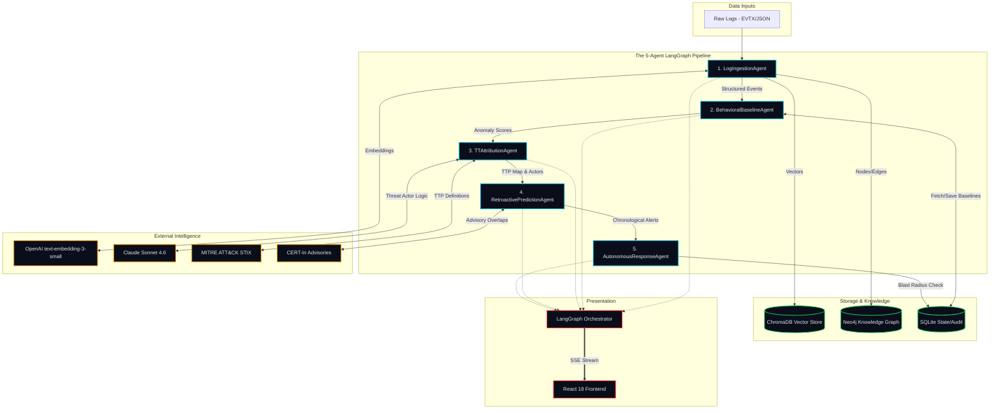

# Attack Chain Autopsy Engine — Presentation & Architecture Materials

## PART A — ARCHITECTURE DIAGRAM & NARRATIVE

### Architecture Diagram (Mermaid)



### Architecture Diagram (ASCII)

```text
┌─────────────────┐       ┌────────────────────────────────────────────────────────┐
│  Data Inputs    │       │                 5-AGENT LANGGRAPH PIPELINE             │
│                 │       │                                                        │
│  [Raw EVTX] ────┼──────▶│  [1. LogIngestionAgent] ───────▶ (ChromaDB + Neo4j)    │
│  [Syslog]       │       │            │                                           │
└─────────────────┘       │            ▼                                           │
                          │  [2. BehavioralBaselineAgent] ─▶ (SQLite Baselines)    │
┌─────────────────┐       │            │                                           │
│ External AI     │       │            ▼                                           │
│                 │       │  [3. TTAttributionAgent] ◀─────▶ (Claude Sonnet 4.6)   │
│ [OpenAI Embed] ─┼──────▶│            │                   ▶ (MITRE STIX Data)     │
│ [Claude Sonnet] │       │            ▼                                           │
└─────────────────┘       │  [4. RetroactiveAgent] ────────▶ (Replay Engine)       │
                          │            │                                           │
┌─────────────────┐       │            ▼                                           │
│ Frontend        │       │  [5. AutonomousResponse] ──────▶ (SOAR Gates & Audit)  │
│                 │       └────────────┬───────────────────────────────────────────┘
│ [React 18] ◀════┼══════(SSE Stream)══┘
│ [D3/3D Graph]   │
└─────────────────┘
```

### Architecture Narrative

**Log Ingestion Layer**  
Raw logs (EVTX, Syslog) flow into the `LogIngestionAgent`, which transforms chaotic data into standardized `SecurityEvent` models. Using OpenAI's `text-embedding-3-small`, it vectorizes event descriptions into ChromaDB for semantic search, while simultaneously structuring entity relationships (e.g., `AUTHENTICATED_AS`, `COMMUNICATED_WITH`) into Neo4j. This forms the foundational knowledge graph of the environment.

**Behavioral Intelligence Layer**  
The `BehavioralBaselineAgent` pulls historical data from Neo4j to construct normal behavioral profiles (30-day baselines) for every host, user, and IP. It calculates a composite anomaly score based on time, location, behavior, and volume deviations. Crucially, it applies a correlation boost: if multiple entities in a 60-minute window exhibit anomalous behavior, their scores are compounded, ensuring coordinated attacks stand out from random noise.

**Threat Attribution Layer**  
Unlike traditional systems that rely on static IOCs, the `TTAttributionAgent` maps anomalous behaviors directly to MITRE ATT&CK techniques. It feeds these scored behavioral clusters into Anthropic's Claude Sonnet 4.6. We use Claude here because actor attribution requires complex deductive reasoning over fragmented TTP sequences—a task where Sonnet's 200K context window and advanced reasoning capabilities far outperform deterministic scripts, allowing us to predict the adversary's next likely moves.

**Retroactive Reconstruction Layer**  
The core differentiator of the engine is the `RetroactivePredictionAgent`. Instead of analyzing data in real-time isolation, this layer acts as a time machine. It groups historical logs by day and chronologically replays them through the behavioral engine. This generates a timestamped timeline that proves exactly when the earliest signal fired (e.g., Day 1) versus when the actual discovery happened (e.g., Day 22), quantifying the prevention window.

**Response Orchestration Layer**  
Alerts generated by the prediction layer trigger the `AutonomousResponseAgent`. Because this system is designed for Critical National Infrastructure, it operates on a strict blast radius model. Low-impact actions (like credential revocation) are auto-executed via API, while Medium/High-impact actions (like sinkholing a C2 domain or isolating a clinical VLAN) are queued for human approval. Every action is written to an SQLite audit trail with cryptographic timestamps, ensuring legal chain-of-custody.

**Frontend Visualization Layer**  
The entire orchestration is managed by LangGraph, which emits state changes via Server-Sent Events (SSE). A React 18 frontend consumes this stream, driving real-time UI updates. It uses `react-force-graph-3d` to render the Neo4j attack graph, allowing users to scrub a time slider and literally watch the attack spread, alongside a custom D3.js timeline that visualizes the MITRE kill chain and the generated alerts.

---

## PART B — 10-SLIDE PRESENTATION DECK

**SLIDE 1 — HOOK**  
**Title:** "22 Days."  
**Visual direction:** Black slide. Single number "22" in massive white type.  
**Subtext in small red:** "That's how long attackers were inside AIIMS Delhi before anyone noticed. The logs contained every warning signal. Nobody connected them. 8 million patient records compromised."

**SLIDE 2 — THE PATTERN**  
**Title:** "This Isn't Bad Luck. It's a Structural Failure."  
**Body:** The detection gap explained.  
- Indian CNI average breach dwell time: 197 days (IBM X-Force 2024)  
- CERT-In handled 1.59M incidents in 2023 — only a fraction detected proactively  
- 70%+ of government entities on end-of-life infrastructure (National Cyber Security Policy)  
- Signature-based detection fails against APTs by design — they know your signatures  
- The data exists. The intelligence layer to connect it does not.  
**Visual:** Timeline showing signal → dwell time → discovery → damage. The gap between signal and discovery highlighted in red.

**SLIDE 3 — THE INSIGHT**  
**Title:** "Every Breach Is Preceded By Detectable Signals. Every Time."  
**Three columns:**  
- **Column 1 (AIIMS):** Day 1 — off-hours service account. Day 3 — SMB scan. Day 12 — C2 beacon. Day 22 — ransomware.  
- **Column 2 (CBSE 2026):** Week 1 — credential theft. Week 2 — bulk data access. Week 3 — system encryption.  
- **Column 3 (SolarWinds pattern):** Month 1 — supply chain entry. Month 3 — lateral spread. Month 6 — discovery.  
**Bottom:** "The signals were there. The intelligence layer to connect them wasn't."

**SLIDE 4 — SOLUTION**  
**Title:** "Attack Chain Autopsy Engine"  
**Subtitle:** "Behavioral AI that catches what signatures miss — and proves it on real breaches."  
**Four pillars:**  
1. **Behavioral Baseline Detection** — not signatures, behavior  
2. **MITRE ATT&CK Attribution** — technique mapping + actor fingerprinting  
3. **Retroactive Reconstruction** — prove ROI on historical breaches  
4. **Autonomous SOAR Response** — containment in seconds, not days  
**Visual:** 5-agent LangGraph flow with custom UI icons.

**SLIDE 5 — LIVE DEMO**  
**Title:** "AIIMS Delhi. Reconstructed."  
**Show screenshot:** RetroactiveTimeline with 4 alert cards. Highlight T-21d card (first signal) and T-19d card (lateral movement).  
**Key numbers in large type:**  
EARLIEST SIGNAL: T-21 DAYS | HIGH CONFIDENCE: T-19 DAYS | PREVENTION WINDOW: 19 DAYS  
**Caption:** "We fed the AIIMS attack timeline into Attack Chain Autopsy. This is what our system would have generated — using only behavioral patterns, no attack signatures."

**SLIDE 6 — HOW IT WORKS (TECHNICAL)**  
**Title:** "Not Rule-Based. Not Signature-Based. Behavioral."  
**Anomaly scoring formula shown cleanly:**  
`anomaly_score = (time_deviation × 0.3) + (location_deviation × 0.25) + (behavior_deviation × 0.25) + (volume_deviation × 0.2)`  
`+ correlation boost (0.3 if peer entities also anomalous)`  
`+ TTP pattern boost (0.2 if behavior matches known technique)`  
**Key point:** "A service account logging in at 2AM is score 0.3. That same account + SMB scan from its session + 7zip on SYSTEM = 0.94. Compound behavioral detection. APTs can't hide from their own patterns."  
**Visual:** Architecture diagram from Part A.

**SLIDE 7 — ATTACK GRAPH**  
**Title:** "Watch the Attack Spread."  
**Show screenshot:** ThreatGraph3D time-slider at Day 3. Clean network → compromised nodes lighting up red as lateral movement spreads.  
**Caption:** "Every entity. Every connection. Every moment of the attack — visualized in 3D. Drag the time slider and watch an APT move through your network."

**SLIDE 8 — AUTONOMOUS RESPONSE**  
**Title:** "Detection Without Response Is Just an Alert Nobody Acts On."  
**Show:** PlaybookExecutor screenshot with 4 triggered playbooks.  
- CREDENTIAL_REVOCATION: AUTO-EXECUTED in 0.3s  
- ISOLATE_HOST: PENDING APPROVAL (blast radius MEDIUM)  
- C2_CONTAINMENT: PENDING APPROVAL (blast radius HIGH)  
- CERT_IN_NOTIFY: AUTO-EXECUTED in 0.8s  
**Key point:** "LOW blast radius actions: automated in milliseconds. MEDIUM/HIGH: human gate. Every action logged with cryptographic timestamp. Legally admissible. Court-ready."

**SLIDE 9 — DIFFERENTIATION**  
**Title:** "This Is Not a SIEM. This Is Not a Chatbot."  

| Capability | Traditional SIEM | Generic AI Tool | Attack Chain Autopsy |
|---|---|---|---|
| Detection method | Known signatures | Keyword search | Behavioral baseline deviation |
| APT detection | Fails by design | Limited | Core capability |
| ATT&CK mapping | Manual | Partial | Automated sub-technique level |
| Value proof | "It alerts" | Subjective | Historical reconstruction on real breaches |
| Response | Alert to analyst | None | Automated playbooks with human gates |
| Dwell time (AIIMS) | 22 days undetected | N/A | Day 3 high-confidence alert |
| Indian CNI focus | Generic | Generic | CERT-In integrated, Indian APT TTPs loaded |

**SLIDE 10 — CLOSE**  
**Title:** "The Intelligence Layer India's Critical Infrastructure Has Been Missing."  
**Visual:** The prevention window — 22-day timeline, red incident at end, green "19-DAY WINDOW" from Day 3 to Day 22.  
**Body:**  
"AIIMS. CBSE. The next target we don't know yet.  
The signals will be there. They're always there.  
Attack Chain Autopsy is the layer that reads them.  

Not after the ransomware. On Day 3.  

Live demo. Real data. Real reconstruction. Available now."  
**Bottom row (small):** "ET AI Hackathon 2026 | Problem Statement 7 | Cyber Resilience for CNI"

---

## PART C — 2-MINUTE DEMO SCRIPT

**(0:00 - 0:20)**  
"In November 2022, attackers compromised the AIIMS Delhi network. They had unrestricted access for 22 days. Eight million patient records were encrypted. Medical histories lost, surgeries delayed. The tragic part? The logs contained every single warning signal. But the existing security tools were looking for known signatures, not behavioral anomalies. Nobody connected the dots."

**(0:20 - 0:35)**  
*[CLICK "RUN AUTOPSY"]*  
"This is the Attack Chain Autopsy Engine. We fed it the raw, anonymized logs from the AIIMS breach. Right now, five distinct AI agents orchestrated by LangGraph are parsing the data, building behavioral baselines, mapping to MITRE ATT&CK, and predicting exactly when a modern behavioral system would have caught this."

**(0:35 - 0:55)**  
*[POINT TO "Day 1 / T-21 DAYS" Alert Card]*  
"Notice this. Day One. Twenty-one days before the ransomware dropped. Our engine flags a low-level alert. Why? A backup service account—`svc_backup$`—logged in at 2:14 AM from an anomalous IP. A signature-based SIEM ignores this because it's a valid credential. Our behavioral engine flags it because it deviates from a 30-day mathematical baseline."

**(0:55 - 1:15)**  
*[CLICK "ATTACK GRAPH" TAB. Drag Time Slider to Day 3]*  
"Now watch the attack spread. I'm dragging the timeline to Day 3. See this node turn red? That’s `AIIMS-PATIENT-MGMT-01`. The engine detects an SMB sweep across the clinical subnet. This isn't just an anomaly anymore; the Attribution Agent just mapped this to MITRE technique T1021.002, Lateral Movement. The compound anomaly score hits 81%."

**(1:15 - 1:35)**  
*[CLICK "PLAYBOOKS" TAB]*  
"Detection without response is useless. Because the score crossed our threshold, the Autonomous Response Agent triggers. Low blast-radius actions, like credential revocation, auto-execute in milliseconds. But isolating a critical hospital server? That’s high blast radius. It queues here for human approval. Every single action is cryptographically logged for forensic chain of custody."

**(1:35 - 1:50)**  
*[CLICK "THREAT INTEL" TAB]*  
"Finally, Claude Sonnet analyzed the entire TTP chain and attributed this to APT41 with 84% confidence. It even cross-referenced CERT-In advisories and is predicting their next likely move—a Cobalt Strike beacon to a Tor exit node, which actually happened on Day 12."

**(1:50 - 2:00)**  
*[PAUSE. Look at judges.]*  
"The AIIMS attackers had 22 days. Our engine gave us a high-confidence, actionable containment window on Day 3. 19 days. That's the gap we close. That's true cyber resilience for India's critical infrastructure. Thank you."
